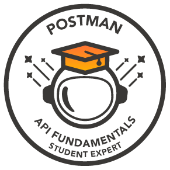
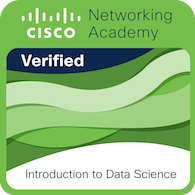
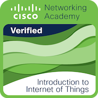
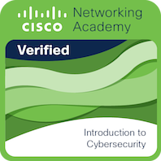

## Hi there 👋 My name is Aashman and here are some things about me😁
- 😄 Pronouns: he/him
- 🌱 I’m currently learning Machine Learning 
- 📫 How to reach me: reach_aashman@outlook.com
<!--
**not-aashman/not-aashman** is a ✨ _special_ ✨ repository because its `README.md` (this file) appears on your GitHub profile.

Here are some ideas to get you started:

- 🔭 I’m currently working on ...

- 👯 I’m looking to collaborate on ...
- 🤔 I’m looking for help with ...
- 💬 Ask me about ...

- 😄 Pronouns: ...
- 🌱 I’m currently learning ...
- 📫 How to reach me: ...
- ⚡ Here are my achievements: ...
-->
## Badges 

